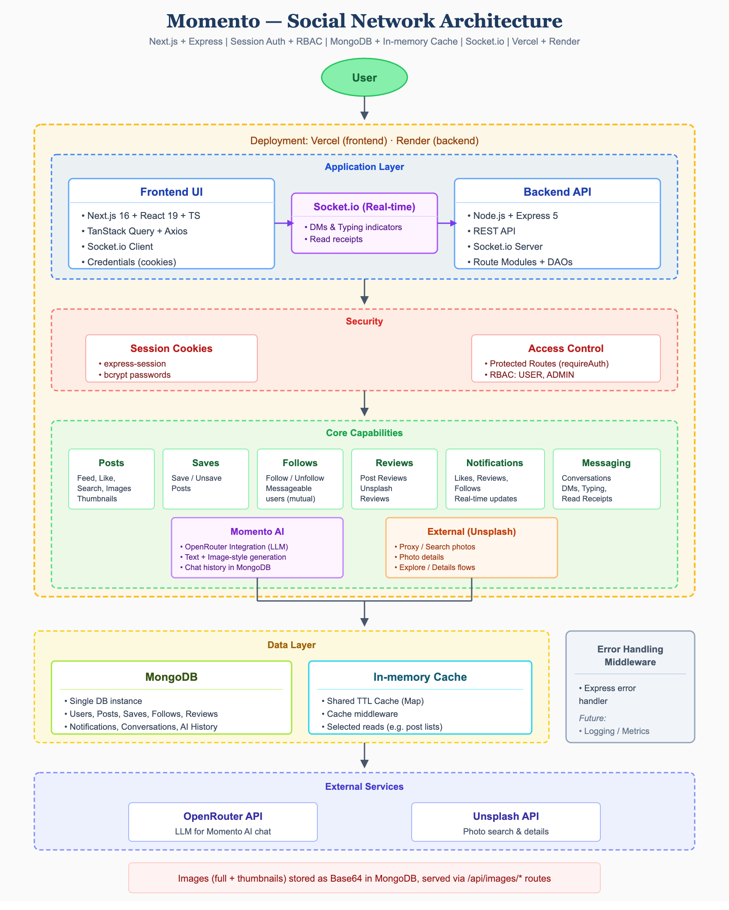

# Momento Frontend


**Social network client for Momento – posts, reviews, real-time messaging, AI assistant, and Unsplash integration.**

Momento Frontend is the client-side application for the Momento social network. It provides a responsive experience for browsing feeds, creating posts, following users, writing reviews, chatting in real time, and using the Momento AI assistant. Built with the Next.js App Router, React Query, and Socket.io for live updates.

## Architecture

The diagram below shows how the full Momento app fits together: this frontend (Vercel), the backend API (Render), security, core capabilities, data layer, and external services.



---

## Features

### Core

- **Authentication** – Sign up, sign in (email or username), sign out. Session-based auth with protected routes. Role-based access (USER, ADMIN).
- **Home & Explore** – Infinite-scroll home feed, explore with filters (latest, oldest, most liked, most reviewed), and search.
- **Posts** – Create, edit, delete posts with image upload, caption, location, and tags. Like, save, and view post-level reviews with star ratings.
- **Profiles** – Own and others’ profiles with posts, followers, following, saved posts, and liked posts.
- **Notifications** – In-app notifications for likes, follows, and reviews; unread count and mark-as-read.

### Real-Time & AI

- **Direct messages** – User-to-user chat via Socket.io. Conversation list, typing indicators, read receipts. Messaging limited to mutually followed users.
- **Momento AI** – In-app AI assistant (OpenRouter) for caption ideas, post suggestions, and engagement tips. Chat history persisted via backend.

### External & Admin

- **Unsplash** – Search and details for external photos; review external content and link reviews to profiles.
- **Admin** – Admin-only dashboard: view all users and posts, delete users (except self) and posts.

### UI

- Responsive layout: bottom nav (mobile), sidebar (desktop/tablet). Dark theme, shared components (cards, dialogs, forms).

---

## Tech Stack

| Layer | Tech |
| ----- | ----- |
| **Framework** | Next.js 16 (App Router), React 19, TypeScript |
| **Styling** | Tailwind CSS, Radix UI–based components (shadcn-style) |
| **Data** | TanStack Query (React Query), Axios API client |
| **Forms** | React Hook Form, Zod validation |
| **Real-time** | Socket.io client |
| **UI** | Lucide icons, react-markdown, emoji-picker-react |

---

## Project Structure

```
momento-frontend/
├── app/
│   ├── (auth)/                 # Auth route group
│   │   ├── layout.tsx
│   │   ├── sign-in/page.tsx
│   │   └── sign-up/page.tsx
│   ├── (momento)/              # Main app route group
│   │   ├── layout.tsx          # Sidebar, topbar, bottombar
│   │   ├── page.tsx            # Home feed
│   │   ├── explore/page.tsx
│   │   ├── create-post/        # Post creation
│   │   ├── posts/[id]/         # Post detail
│   │   ├── profile/[id]/       # User profile, liked posts
│   │   ├── saved/page.tsx
│   │   ├── messages/           # Chat list
│   │   ├── messages/[userId]/  # Conversation with user
│   │   ├── notifications/
│   │   ├── admin/              # Admin dashboard
│   │   ├── all-users/
│   │   ├── details/[id]/       # Unsplash detail
│   │   ├── about/, privacy/
│   │   └── update-profile/[id]/, update-post/[id]/
│   ├── layout.tsx
│   └── page.tsx                # Landing
├── components/
│   ├── shared/                 # PostCard, GridPostList, Topbar, etc.
│   ├── forms/                  # PostForm
│   ├── messages/               # ChatHeader, MessageBubble, ChatInput
│   └── ui/                     # Button, Input, Avatar, Toast, etc.
├── context/
│   └── AuthContext.tsx         # Auth state, current user
├── hooks/
│   ├── useSocket.ts            # Socket.io lifecycle, listeners
│   └── useDebounce.ts
├── lib/
│   ├── api/
│   │   ├── client.ts           # Axios client, all API calls
│   │   └── socket.ts           # Socket.io connection
│   ├── react-query/            # Queries, mutations, QueryProvider
│   ├── types/                  # Shared types, errors
│   └── validation/             # Zod schemas
├── constants/
├── types/
└── public/assets/
```

- **`lib/api/client.ts`** – Central API layer. All HTTP calls (auth, users, posts, saves, follows, reviews, notifications, conversations, Momento AI, external, admin) use the same Axios instance with `withCredentials` for session cookies.
- **`lib/api/socket.ts`** + **`useSocket`** – Socket.io connection tied to the current user; listeners for new messages, typing, read receipts, and notifications; React Query invalidation on events.
- **`app/(momento)/layout.tsx`** – Renders shared layout (sidebar, topbar, bottombar) and wraps children with providers.

---

## Quick Start

### Prerequisites

- **Node.js** 18+
- Running **Momento Backend** (see [momento-backend](https://github.com/nirajmehta960/momento-backend))

### Installation

1. **Clone and install**

   ```bash
   git clone https://github.com/nirajmehta960/momento-frontend.git
   cd momento-frontend
   npm install
   ```

2. **Environment**

   Create `.env.local`:

   ```env
   NEXT_PUBLIC_API_URL=http://localhost:4000/api
   ```

   The app expects the backend at `NEXT_PUBLIC_API_URL` (with `/api` suffix). Session cookies are sent cross-origin when backend `CLIENT_URL` matches the frontend origin.

3. **Run**

   ```bash
   npm run dev
   ```

   App runs at [http://localhost:3000](http://localhost:3000).

---

## Environment Variables

| Variable | Description |
| -------- | ----------- |
| `NEXT_PUBLIC_API_URL` | Backend API base URL (e.g. `http://localhost:4000/api`) |

---

## Scripts

| Command | Description |
| ------- | ----------- |
| `npm run dev` | Start Next.js dev server |
| `npm run build` | Production build |
| `npm start` | Run production server |
| `npm run lint` | Run ESLint |

---

## Deployment

This frontend is deployed on **Vercel**; the backend runs on **Render**. To deploy yourself:

1. Set `NEXT_PUBLIC_API_URL` to your backend API URL (e.g. your Render backend URL + `/api`).
2. Ensure backend `CLIENT_URL` matches the frontend origin (for CORS and session cookies).
3. Use the platform’s Next.js preset (e.g. Vercel auto-detects Next.js) or `npm run build` and `npm start`.

---

## Contributing

1. Fork the repository.
2. Create a feature branch (`git checkout -b feature/your-feature`).
3. Commit changes (`git commit -m 'Add your feature'`).
4. Push and open a Pull Request (`git push origin feature/your-feature`).

Follow existing patterns, use TypeScript strictly, and run `npm run lint`.

---

## License

This project is licensed under the **MIT License** – you can use, copy, modify, merge, publish, distribute, sublicense, and sell copies, under the terms of the [MIT license](LICENSE). See [LICENSE](LICENSE) for the full text.

---

## Authors

**Niraj Mehta** – [GitHub @nirajmehta960](https://github.com/nirajmehta960)

---

## Related

- **Backend API:** [momento-backend](https://github.com/nirajmehta960/momento-backend)
